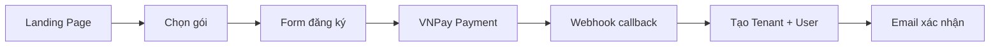

<div align="center">

# 🛡️ CyberMonitor SOC Platform

### Hệ thống Security Operations Center (SOC) hoàn chỉnh
**Phát hiện và ứng cứu sự cố bảo mật tự động bằng AI**

[](https://dotnet.microsoft.com/)
[](https://react.dev/)
[](https://www.python.org/)
[](https://www.microsoft.com/sql-server)
[](https://www.typescriptlang.org/)
[](LICENSE)

[Tính năng](#-tính-năng-nổi-bật) • [Kiến trúc](#️-kiến-trúc-hệ-thống) • [Cài đặt](#-cài-đặt-nhanh) • [Demo](#-tài-khoản-demo) • [API](#-api-endpoints)

</div>

---

## ✨ Tính năng nổi bật

<table>
<tr>
<td width="50%">

### 🤖 AI-Powered Detection
- **Isolation Forest ML** phát hiện anomaly tự động
- Nhận diện DDoS, Brute Force, Port Scan
- Cập nhật baseline mỗi 60 giây
- MITRE ATT&CK mapping

</td>
<td width="50%">

### ⚡ Real-time Monitoring
- **SignalR** push alerts tức thì
- Dashboard cập nhật live
- Traffic visualization với Recharts
- Web Worker xử lý data nặng

</td>
</tr>
<tr>
<td width="50%">

### 🎫 Ticketing System
- Workflow: New → Assigned → In Progress → Closed
- Comment tracking & audit log
- Email notification tự động
- SLA tracking

</td>
<td width="50%">

### 💳 SaaS Ready
- **VNPay** payment integration
- Multi-tenant architecture
- Subscription management
- Role-based access control

</td>
</tr>
<tr>
<td width="50%">

### 📊 Advanced Reporting
- Export Excel với EPPlus
- Top attack sources
- Incident timeline
- Custom date range

</td>
<td width="50%">

### 🔐 Enterprise Security
- JWT authentication
- API Key per server
- 3-tier permissions
- Audit logging

</td>
</tr>
</table>

---

## 🏗️ Kiến trúc hệ thống

```
┌─────────────────────────────────────────────────────────────────┐
│                        CLIENTS / AGENTS                         │
│  (Agent Python chạy trên server khách hàng)                    │
│  → Bắn traffic logs về mỗi 5 giây                                │
└─────────────────────┬───────────────────────────────────────────┘
                      │ POST /api/logs/ingest (X-API-Key auth)
                      ▼
┌─────────────────────────────────────────────────────────────────┐
│              ASP.NET Core 8.0 Backend API                       │
│  • Auth (JWT) + Phân quyền 3 cấp (SuperAdmin/Admin/User)       │
│  • SignalR Hub (Real-time alerts)                                │
│  • VNPay Integration (Payment)                                  │
│  • Email Service (SendGrid/Gmail)                                │
│  • Swagger: http://localhost:5000/swagger                        │
└───────┬─────────────────────────────────┬───────────────────────┘
        │                                 │
        ▼                                 ▼
┌─────────────────────┐       ┌───────────────────────────────────┐
│   AI Engine Service  │       │         SQL Server 2022           │
│   (Python, ML-based)│       │  • Tenants, Users, Servers         │
│   Isolation Forest   │       │  • TrafficLogs, Alerts, Tickets    │
│   Cron: mỗi 60s      │       │  • PaymentOrders, Notifications    │
└─────────────────────┘       └───────────────────────────────────┘
```

---

## 📂 Cấu trúc dự án

```
CyberMonitor/
├── 🎨 Frontend/                # React 19 + TypeScript + Tailwind CSS 4
│   └── src/
│       ├── App.tsx            # Main app với routing
│       ├── services/api.ts     # API client + interceptors
│       ├── components/         # UI components
│       ├── hooks/              # Custom React hooks
│       └── workers/            # Web Workers
│
├── ⚙️ Backend/                 # ASP.NET Core 8.0 Web API
│   └── CyberMonitor.API/
│       ├── Controllers/        # REST API endpoints
│       ├── Models/            # Entities + DTOs
│       ├── Data/               # EF Core DbContext
│       ├── Services/           # Business logic
│       ├── Middlewares/        # API Key auth
│       ├── Hubs/               # SignalR real-time
│       └── Program.cs
│
├── 🤖 Al-Engine/               # Python AI Service
│   ├── ai_engine.py           # Isolation Forest ML
│   ├── ai_engine_baselines.json
│   └── requirements.txt
│
├── 👁️ Agent/                   # Python Monitoring Agent
│   ├── agent.py               # Traffic collector
│   ├── windivert_blocker.py   # Windows firewall
│   └── requirements.txt
│
├── 🗄️ Database/                # SQL Server Scripts
│   ├── Step1_CreateDatabase.sql
│   ├── Step2_CreateTables.sql
│   └── Step3_SeedData.sql
│
├── 📚 Documentation/           # PlantUML Diagrams
│   ├── Architecture_Diagram.puml
│   ├── ERD_Diagram.puml
│   └── Sequence_Diagrams/
│
└── 🚀 DemoLauncher/           # Windows Forms Demo App
    └── Program.cs
```

---

## � 5 Luồng hoạt động chính

### 🛒 Luồng 1: Khách hàng Chốt đơn (SaaS Onboarding)



1. 🌐 Khách vào Landing Page → chọn gói (Starter/Pro/Enterprise)
2. 📝 Nhấn **[Mua gói Pro]** → Form đăng ký (Tên Công Ty, Email, Mật khẩu)
3. 💳 Nhấn **[Thanh toán]** → Backend gọi VNPay API → redirect QR
4. ✅ VNPay webhook callback → Tạo Tenant + User + Subscription trong SQL Server
5. 📧 Gửi email xác nhận

### 👁️ Luồng 2: Cài đặt "Mắt thần" (Agent)

1. 🔑 Admin đăng nhập → **[Quản lý Máy chủ]** → **[+ Thêm Máy Chủ]**
2. 🔐 Backend sinh API Key `sk_live_xxx`, trả về cho Frontend
3. 📋 Khách copy API Key + lệnh cài Agent
4. 🚀 Agent Python chạy `while True`, đọc log mạng → bắn về Backend mỗi 5s

### 🤖 Luồng 3: AI nuốt dữ liệu (Data Ingestion + AI)

1. 📡 Agent bắn logs vào `POST /api/logs/ingest` (API Key auth middleware)
2. 🧠 AI Engine Python cứ 60s lại query logs từ SQL Server
3. 🔍 Isolation Forest phân tích → phát hiện anomaly (DDoS, BruteForce, PortScan...)
4. 🚨 Trigger alert → Backend tạo Alert + Ticket tự động

### 🚨 Luồng 4: Báo động đỏ (Ticketing Workflow)

1. ⚡ Alert được tạo → SignalR push real-time đến Dashboard
2. 📧 Email khẩn gửi đến Admin
3. 👨‍💻 IT nhân viên: Assign → IN_PROGRESS → Điều tra → CLOSED
4. 💬 Comment ghi lại hành động đã xử lý

### 📊 Luồng 5: Báo cáo Excel (Reporting)

1. 📈 Trưởng phòng → **[Báo Cáo]** → Chọn ngày
2. 🔄 Backend query SQL Server → EPPlus tạo file `.xlsx`
3. 📄 File có: Tổng quan, Chi tiết Alerts, Phiếu Sự Cố, Top Nguồn Tấn Công, MITRE ATT&CK

---

## 🔐 Phân quyền

<div align="center">

| 👤 Vai trò | 🔑 Quyền hạn |
|-----------|-------------|
| **🔴 SuperAdmin** | Toàn quyền hệ thống, quản lý mọi Tenant, xem tất cả dữ liệu |
| **🟠 Admin** | Quản lý Tenant của mình, tạo User, Server, xem báo cáo |
| **🟢 User** | Xem Dashboard, Alerts, Tickets được assign cho mình |

</div>

---

## 🚀 Cài đặt nhanh

### ⚙️ Yêu cầu hệ thống

<table>
<tr>
<td>

**Backend**
- .NET 8.0 SDK
- SQL Server 2022
- Visual Studio 2022 (optional)

</td>
<td>

**Frontend**
- Node.js 18+
- npm/yarn/pnpm
- Modern browser

</td>
<td>

**AI & Agent**
- Python 3.10+
- pip
- psutil, scikit-learn

</td>
</tr>
</table>

### 📦 Cài đặt từng bước

#### 1️⃣ Database (SQL Server)

```bash
# 🗄️ Chạy script tạo database
sqlcmd -S localhost -E -i Database/Step1_CreateDatabase.sql
sqlcmd -S localhost -E -i Database/Step2_CreateTables.sql
sqlcmd -S localhost -E -i Database/Step3_SeedData.sql

# 🐳 Hoặc dùng Docker
docker run -e "ACCEPT_EULA=Y" -e "SA_PASSWORD=YourPassword123!" \
  -p 1433:1433 --name sqlserver -d \
  mcr.microsoft.com/mssql/server:2022-latest
```

#### 2️⃣ Backend (ASP.NET Core)

```bash
cd Backend/CyberMonitor.API

# ⚙️ Cập nhật Connection String trong appsettings.json
# "Server=localhost;Database=CyberMonitor;User Id=sa;Password=YourPassword123!"

dotnet restore
dotnet build
dotnet run

# ✅ Backend chạy tại: http://localhost:5000
# 📚 Swagger UI: http://localhost:5000/swagger
```

#### 3️⃣ Frontend (React)

```bash
cd Frontend

# 📦 Cài đặt dependencies
npm install

# 🚀 Chạy development server
npm run dev

# ✅ Frontend chạy tại: http://localhost:5173
```

#### 4️⃣ AI Engine (Python)

```bash
cd Al-Engine
# 📦 Cài đặt dependencies
pip install -r requirements.txt

# 🤖 Chạy AI Engine (production mode)
python ai_engine.py --backend-url http://localhost:5000

# 🧪 Hoặc chạy demo mode (không cần backend)
python ai_engine.py --demo
```

#### 5️⃣ Agent (Python) - Cài trên server cần bảo vệ

```bash
# 🔑 Lấy API Key từ Dashboard → Settings → Server → Copy Key

cd Agent

# 📦 Cài đặt dependencies
pip install -r requirements.txt

# 🚀 Chạy Agent (production mode)
python agent.py --api-key sk_live_xxx --server-url http://localhost:5000

# 🧪 Demo mode (không cần backend)
python agent.py --api-key sk_live_demo --demo
```

#### 6️⃣ Docker Compose (All-in-one) 🐳

```bash
# 🚀 Chạy toàn bộ hệ thống với Docker
docker-compose up -d

# 📊 Kiểm tra logs
docker-compose logs -f

# 🛑 Dừng hệ thống
docker-compose down
```

---

## 🎮 Tài khoản demo

<div align="center">

| 📧 Email | 🔑 Mật khẩu | 👤 Vai trò | 🏢 Tenant |
|---------|------------|-----------|----------|
| `admin@cybermonitor.vn` | `CyberMonitor@2026` | 🔴 SuperAdmin | System |
| `admin@abc-corp.vn` | `CyberMonitor@2026` | 🟠 Admin | ABC Corp |
| `user@abc-corp.vn` | `CyberMonitor@2026` | 🟢 User | ABC Corp |

</div>

---

## � API Endpoints

<div align="center">

| 🔹 Method | 🔹 Endpoint | 🔹 Mô tả |
|----------|------------|---------|
| `POST` | `/api/auth/register` | 📝 Đăng ký + tạo Workspace |
| `POST` | `/api/auth/login` | 🔐 Đăng nhập (JWT) |
| `POST` | `/api/servers/add` | 🖥️ Thêm server + sinh API Key |
| `POST` | `/api/logs/ingest` | 📡 Agent bắn logs (API Key auth) |
| `POST` | `/api/alerts/trigger` | 🚨 AI Engine webhook |
| `GET` | `/api/alerts` | 📋 Danh sách alerts |
| `POST` | `/api/tickets/create` | 🎫 Tạo ticket mới |
| `PUT` | `/api/tickets/{id}/status` | ✅ Cập nhật trạng thái ticket |
| `POST` | `/api/payment/create-url` | 💳 Tạo URL thanh toán VNPay |
| `GET` | `/api/payment/vnpay-return` | ✅ VNPay callback |
| `GET` | `/api/reports/export-excel` | 📊 Xuất báo cáo Excel |
| `WS` | `/hubs/alerts` | ⚡ SignalR Hub (real-time) |

📚 **Swagger Documentation**: `http://localhost:5000/swagger`

</div>

---

## �️ Tech Stack

<div align="center">

### Frontend


### Backend


### Database


### AI & Agent


### Integration


</div>

---

## ✅ Roadmap & TODO

<div align="center">

### ✅ Hoàn thành
- [x] 🗄️ Database schema + seed data
- [x] ⚙️ ASP.NET Core Backend (Auth, Servers, Logs, Alerts, Tickets, Payment, Reports)
- [x] 🔐 API Key authentication middleware
- [x] ⚡ SignalR real-time notifications
- [x] 💳 VNPay integration
- [x] 📧 Email notification service
- [x] 📊 Excel report export (EPPlus)
- [x] 👁️ Python Agent
- [x] 🤖 AI Engine (Isolation Forest)
- [x] 🎨 React Frontend với Tailwind CSS 4
- [x] 📚 PlantUML Documentation

### 🚧 Đang phát triển
- [ ] 🔗 Webhook cho AI Engine (auto-detect threat)
- [ ] 🐳 Docker Compose full deployment
- [ ] 🔄 CI/CD pipeline (GitHub Actions)
- [ ] 📱 Mobile app (React Native)
- [ ] 🌐 Multi-language support (i18n)
- [ ] 📈 Advanced analytics dashboard
- [ ] 🔔 Slack/Teams integration
- [ ] 🛡️ Auto-remediation actions

</div>

</div>

---

## 🤝 Đóng góp

Chúng tôi hoan nghênh mọi đóng góp! Vui lòng:

1. 🍴 Fork repository
2. 🌿 Tạo branch mới (`git checkout -b feature/AmazingFeature`)
3. 💾 Commit changes (`git commit -m 'Add some AmazingFeature'`)
4. 📤 Push to branch (`git push origin feature/AmazingFeature`)
5. 🔀 Mở Pull Request

---

## 📄 License

Dự án này được phân phối dưới giấy phép MIT. Xem file `LICENSE` để biết thêm chi tiết.

---

## 📞 Liên hệ

<div align="center">

**CyberMonitor Team**

[](mailto:contact@cybermonitor.vn)
[](https://github.com/cybermonitor)
[](https://cybermonitor.vn)

---

⭐ **Nếu dự án hữu ích, hãy cho chúng tôi một Star!** ⭐

Made with ❤️ by CyberMonitor Team

</div>
